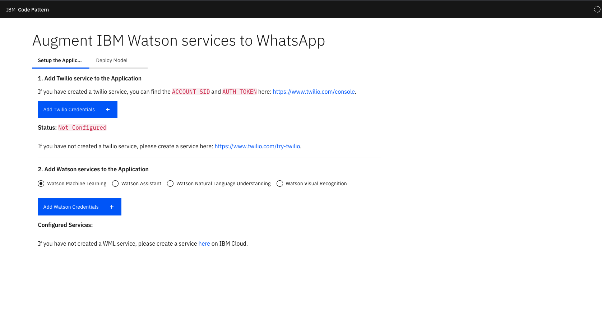
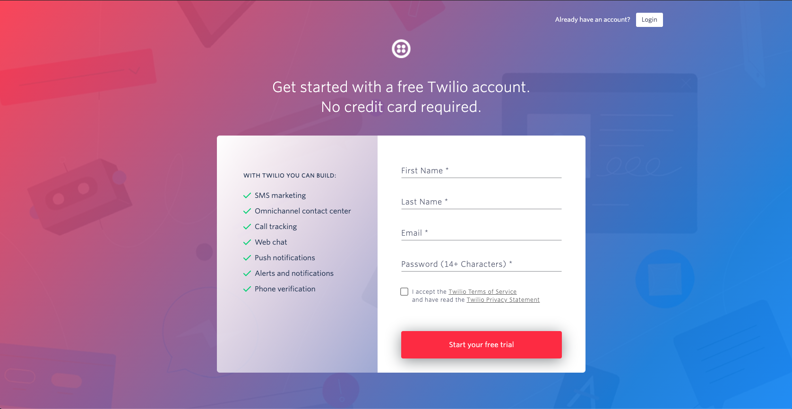
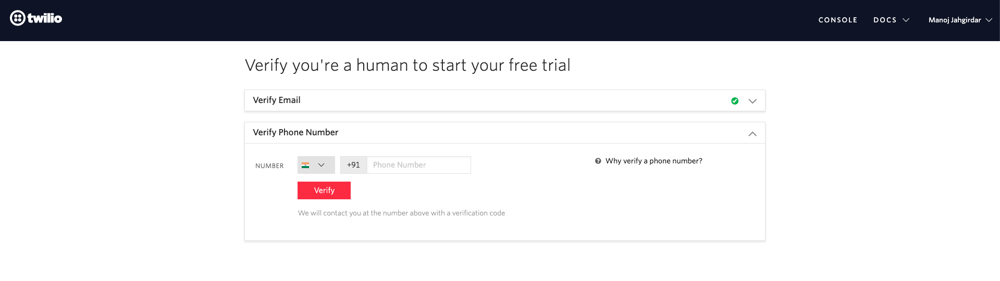
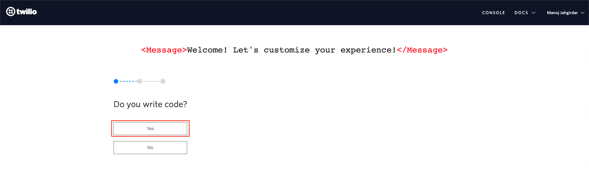
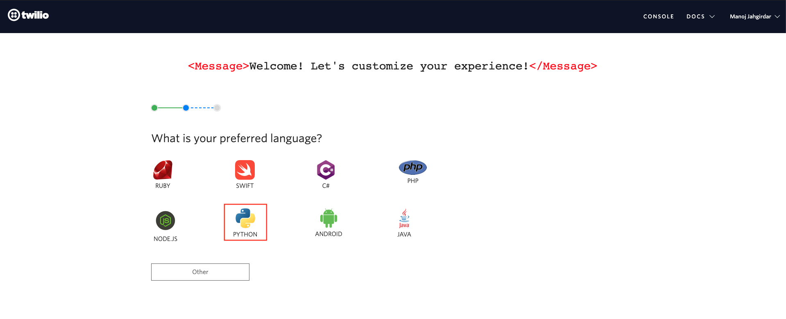

# Climate Messenger

[](https://www.apache.org/licenses/LICENSE-2.0) [](https://developer.ibm.com/callforcode/get-started/) [](https://callforcode.org/)

__Climate Messenger__ is a whatsapp-based bot that uses machine learning to predict *__Agriculture Producer Prices__* based on users *__location__*, provide latest agricultural news and search options.

## Contents

- [Climate Messenger](#climate-messenger)
  - [Contents](#contents)
  - [Short description](#short-description)
    - [What's the problem?](#whats-the-problem)
    - [How can technology help?](#how-can-technology-help)
    - [The idea](#the-idea)
  - [Demo video](#demo-video)
  - [The architecture](#the-architecture)
  - [Long description](#long-description)
  - [Project roadmap](#project-roadmap)
  - [Getting started](#getting-started)
  - [Built with](#built-with)
  - [Contributing](#contributing)
  - [Authors](#authors)
  - [Acknowledgments](#acknowledgments)
  - [License](#license)

<<<<<<< HEAD
<!--add an image in this path-->


<!--Optionally, add flow steps based on the architecture diagram-->
## Flow

1. User sends a message through WhatsApp.

2. The message is redirected to Twilio Programmable Messaging service.

3. Twilio Programmable Messaging service will further forward the message to the framework hosted on IBM Cloud.

4. The framework interacts with the Watson Machine Learning service to get the response.

5. Watson Machine Learning service does the necessary computation and returns a response accordingly.

6. The framework processes the response and converts it to user readable format and forwards it Twilio.

7. Twilio forwards this message as a reply on WhatsApp.

8. The user will receive this as a response from Watson Machine Learning service on WhatsApp.

<!--Optionally, update this section when the video is created-->
# Watch the Video

[](https://www.youtube.com/watch?v=lP_gNI73KBU&ab_channel=KenechukwuNnodu)

# Pre Requisites

1. [IBM Cloud Account](https://cloud.ibm.com/registration).
2. [IBM Cloud CLI](https://cloud.ibm.com/docs/cli?topic=cloud-cli-getting-started&locale=en-US).
3. [IBM Cloud Object Storage](https://cloud.ibm.com/catalog/services/cloud-object-storage).


# Steps

1. [Clone the repo](#1-clone-the-repo).
2. [Deploy the framework on IBM Cloud Foundry](#2-deploy-the-framework-on-ibm-cloud-foundry).
3. [Create Twilio service](#3-create-twilio-service).
4. [Create Watson services](#4-create-watson-services).
     - [4.1. Watson Machine Learning](#41-watson-machine-learning).
     - [4.2. Watson Studio](#42-watson-studio).
5. [Configure credentials](#5-configure-credentials).
6. [Deploy the Food Price Prediction model](#6-deploy-the-house-price-prediction-model).


### 1. Clone the repo

Clone the `code-engine-dsnbot` repo locally. In a terminal, run:

```bash
git clone https://github.com/kenextra/code-engine-dsnbot
```

We’ll be using the folder [`backend-for-whatsapp`](backend-for-whatsapp)

### 2. Deploy the framework on IBM Cloud Foundry

- Before you proceed, make sure you have installed [IBM Cloud CLI](https://cloud.ibm.com/docs/cli?topic=cloud-cli-getting-started&locale=en-US) in your deployment machine.

- From the cloned repo, goto **backend-for-whatsapp** directory in terminal, and run the following commands to deploy the Application to IBM Cloud Foundry.

```bash
$ cd backend-for-whatsapp/
```

* Log in to your IBM Cloud account, and select an API endpoint.
```bash
$ ibmcloud login
```

>NOTE: If you have a federated user ID, instead use the following command to log in with your single sign-on ID.

```bash
$ ibmcloud login --sso
```

* Target a Cloud Foundry org and space:
```bash
$ ibmcloud target --cf
```

* From within the _backend-for-whatsapp directory_ push your app to IBM Cloud.
```bash
$ ibmcloud cf push whatsapp-server
```

- The [manifest.yml](backend-for-whatsapp/manifest.yml) file will be used here to deploy the application to IBM Cloud Foundry.

- On Successful deployment of the application you will see something similar on your terminal as shown.

<pre><code>Invoking 'cf push'...

Pushing from manifest to org manoj.jahgirdar@in.ibm.com / space dev as manoj.jahgirdar@in.ibm.com...

...

Waiting for app to start...

name:              whatsapp-server
requested state:   started
routes:            <b>whatsapp-server.xx-xx.mybluemix.net </b>
last uploaded:     Sat 16 May 18:05:16 IST 2020
stack:             cflinuxfs3
buildpacks:        python

type:            web
instances:       1/1
memory usage:    256M
start command:   python app.py
     state     since                  cpu     memory           disk           details
#0   <b>running</b>   2020-05-16T12:36:15Z   25.6%   116.5M of 256M   796.2M of 1
</code></pre>

* Once the app is deployed you can visit the `routes` to launch the application.

>Example: http://whatsapp-server.xx-xx.mybluemix.net

- At this point, you will have successfully deployed the framework on IBM Cloud. Now lets access it and see how it looks like.

- Visit the `URL` in your browser to access the framework.

>Example: http://whatsapp-server.xx-xx.mybluemix.net

- You will now have access to the framework through which you can configure **Twilio** and **Watson services**.



- In this code pattern, the scope is restrected to **Watson Machine Learning service**, hence you will learn _how to deploy a simple food price prediction model_ and access it from your WhatsApp messenger.

- Before deploying the model, you will have to create a Twilio service, steps for which are given below.

### 3. Create Twilio service

Twlio is a SaaS offering that provides APIs to make and receive calls or text messages. As there are no APIs from WhatsApp directly availabe to send and receive WhatsApp messages programmatically, you will learn how to use Twilio's messaging service APIs that provides gateway to communicate with WhatsApp programmatically. Lets start by creating a free Twilio service.

- Create a free Twilio service here: <https://www.twilio.com/try-twilio>.

- Enter the your details to signup as shown.



- Once you create a twilio service, you will have to verify your email id as well as your phone number.

- To verify your email id, visit your registered email id and you will see a mail from twilio with a verification link, go ahead and verify.


- Once email id is verified you will be prompted to enter your phone number, submit that and you will get an OTP on your registered number, enter that back to verify.



- On successful verification you should see a welcome greeting message, additionally you will see a question **Do you write code?**, select **Yes** to proceed.



- The second question asked to you would be **What is your preferred language?**, select **Python** to proceed.


=======
## Short description
Whatsapp-based bot, for agriculture news, price prediction and search options
>>>>>>> update_html

### What's the problem?

Approximately 9 percent of the global population is suffering from hunger. And, much of the world’s food is grown by small-scale, independent farms and distributed through local community cooperatives who sell the surplus produce. These independent farmers and co-ops do not have accessible tools/platforms to get the right information for better crop production and price fairness.

### How can technology help?

By providing access to useful information to independent farmers and co-ops through a familiar platform that is easy to use.

### The idea

To improve access to information using technologies that are already accessible and familiar to farmers and co-ops so they don't have to learn new technology.


## The architecture

<!--add an image in this path-->


<!--Optionally, add flow steps based on the architecture diagram-->
## Flow

1. User sends a message through WhatsApp.

2. The message is redirected to Twilio Programmable Messaging service.

3. Twilio Programmable Messaging service will further forward the message to the framework hosted on IBM Cloud.

4. The framework interacts with one of the Watson services to get the response.

5. The Watson service does the necessary computation and returns a response accordingly.

6. The framework processes the response and converts it to user readable format and forwards it Twilio.

7. Twilio forwards this message as a reply on WhatsApp.

8. The user will receive this as a response from Watson service on WhatsApp.

The workflow of the app is as follows:

>NOTE: The user has to follow the exact same workflow for the WhatsApp to reply as intended.

User|Reply|Screenshot
---|---|---
Hi | The message, 'Hi' that you typed on your phone, went through Whatsapp -> Twilio -> Python App hosted on IBM Cloud and returned back to you from Python App hosted on IBM Cloud -> Twilio -> Whatsapp. How Cool is that!! Try asking <b>What can you do?</b> | 
What can you do? | I am a bot who is connected to watson services on IBM Cloud! Try asking <b>What are the services you are connected to?</b> | 
What are the services you are connected to? | I found the following services associated to me: 1. Watson Machine Learning -> *ready* Enter the number to know more. 2. Watson Visual Recognition -> No Custom Model Deployed 3. Watson Assistant -> For Agriculture News| 
1 | WML Model id: *xxxx-xxxx-xxxx* WML Model Name: *Deployment of Food Price Prediction* WML Model Status: *ready* Try asking <b>I want to know food prices</b> | 
I want to know food prices | Please enter the details with the below format: Predict:`<Country>`,`<Item>`, Example: Predict:Germany,Apples | 
3 | Watson Assistant Type <b>News</b> for Agriculture News | 

## Demo video

[](https://youtu.be/vOgCOoy_Bx0)


## Long description

[More detail is available here](DESCRIPTION.md)

## Project roadmap

See below for our proposed schedule on next steps after Call for Code 2021 submission.

See [ROADMAP.md](ROADMAP.md)

## Getting started

See [SETUP.md](SETUP.md)

## Built with

- [IBM Cloud Foundry](https://cloud.ibm.com/catalog?search=cloud%20foundry#search_results) - The compute platform used for creating and deploying applications
- [Watson Machine Learning](https://cloud.ibm.com/catalog?search=machine%20learning#search_results) - Uesd to build the ML model
- [Watson Studio](https://cloud.ibm.com/catalog?search=studio#search_results) - Uesd to deploy the ML model.
- [Object Storage](https://cloud.ibm.com/catalog?search=object%20storage#search_results) - Used to store ML Model and artifacts
- [Twilio Messaging API](https://www.twilio.com/) - Programmable Messaging service used.

## Contributing

Please read [CONTRIBUTING.md](CONTRIBUTING.md) for details on our code of conduct, and the process for submitting pull requests to us.


## Authors

* [Richard](https://github.com/RichardTalented)
* [Ansh Dholakia](https://github.com/anshdholakia)
* [Kenechukwu Nnodu](https://github.com/kenextra)


## Acknowledgments

1. [Augment IBM Watson Services to WhatsApp](https://github.com/IBM/augment-watson-services-to-whatsapp)

2. [Augment Watson Visual Recognition service with WhatsApp](https://github.com/IBM/augment-watson-services-to-whatsapp-2)


## License

This project is licensed under the Apache 2 License - see the [LICENSE](LICENSE) file for details.
