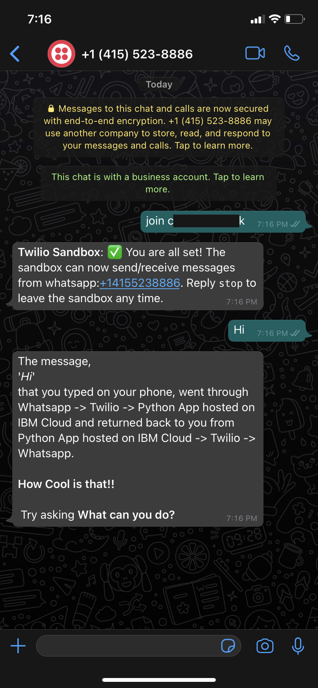

# Climate Messenger

  

__Climate Messenger__ is a whatsapp-based bot that uses machine learning to predict *__Agriculture Producer Prices__* based on users *__location__*, provide latest agricultural news and search options.

## Contents

- [Climate Messenger](#climate-messenger)
  - [Contents](#contents)
  - [Short description](#short-description)
    - [What's the problem?](#whats-the-problem)
    - [How can technology help?](#how-can-technology-help)
    - [The idea](#the-idea)
  - [Demo video](#demo-video)
  - [The architecture](#the-architecture)
  - [Long description](#long-description)
  - [Project roadmap](#project-roadmap)
  - [Getting started](#getting-started)
  - [Built with](#built-with)
  - [Contributing](#contributing)
  - [Authors](#authors)
  - [Acknowledgments](#acknowledgments)
  - [License](#license)

## Short description
Whatsapp-based bot, for agriculture news, price prediction and search options

### What's the problem?

Approximately 9 percent of the global population is suffering from hunger. And, much of the world’s food is grown by small-scale, independent farms and distributed through local community cooperatives who sell the surplus produce. These independent farmers and co-ops do not have accessible tools/platforms to get the right information for better crop production and price fairness.

### How can technology help?

By providing access to useful information to independent farmers and co-ops through a familiar platform that is easy to use.

### The idea

To improve access to information using technologies that are already accessible and familiar to farmers and co-ops so they don't have to learn new technology.

## The architecture

<!--add an image in this path-->

<!--Optionally, add flow steps based on the architecture diagram-->
## Flow

1. User sends a message through WhatsApp.

2. The message is redirected to Twilio Programmable Messaging service.

3. Twilio Programmable Messaging service will further forward the message to the framework hosted on IBM Cloud.

4. The framework interacts with one of the Watson services to get the response.

5. The Watson service does the necessary computation and returns a response accordingly.

6. The framework processes the response and converts it to user readable format and forwards it Twilio.

7. Twilio forwards this message as a reply on WhatsApp.

8. The user will receive this as a response from Watson service on WhatsApp.

The workflow of the app is as follows:

>NOTE: The user has to follow the exact same workflow for the WhatsApp to reply as intended.

User|Reply|Screenshot
---|---|---
Hi | The message, 'Hi' that you typed on your phone, went through Whatsapp -> Twilio -> Python App hosted on IBM Cloud and returned back to you from Python App hosted on IBM Cloud -> Twilio -> Whatsapp. How Cool is that!! Try asking <b>What can you do?</b> | 
What can you do? | I am a bot who is connected to watson services on IBM Cloud! Try asking <b>What are the services you are connected to?</b> | 
What are the services you are connected to? | I found the following services associated to me: 1. Watson Machine Learning -> *ready* Enter the number to know more. 2. Watson Visual Recognition -> No Custom Model Deployed 3. Watson Assistant -> For Agriculture News| 
1 | WML Model id: *xxxx-xxxx-xxxx* WML Model Name: *Deployment of Food Price Prediction* WML Model Status: *ready* Try asking <b>I want to know food prices</b> | 
I want to know food prices | Please enter the details with the below format: Predict:`<Country>`,`<Item>`, Example: Predict:Germany,Apples | 
3 | Watson Assistant Type <b>News</b> for Agriculture News | 

## Demo video

## Long description

[More detail is available here](DESCRIPTION.md)

## Project roadmap

See below for our proposed schedule on next steps after Call for Code 2021 submission.

See [ROADMAP.md](ROADMAP.md)

## Getting started

See [SETUP.md](SETUP.md)

## Built with

- [IBM Cloud Foundry](https://cloud.ibm.com/catalog?search=cloud%20foundry#search_results) - The compute platform used for creating and deploying applications
- [Watson Machine Learning](https://cloud.ibm.com/catalog?search=machine%20learning#search_results) - Uesd to build the ML model
- [Watson Studio](https://cloud.ibm.com/catalog?search=studio#search_results) - Uesd to deploy the ML model.
- [Object Storage](https://cloud.ibm.com/catalog?search=object%20storage#search_results) - Used to store ML Model and artifacts
- [Twilio Messaging API](https://www.twilio.com/) - Programmable Messaging service used.

## Contributing

Please read [CONTRIBUTING.md](CONTRIBUTING.md) for details on our code of conduct, and the process for submitting pull requests to us.

## Authors

* [Richard](https://github.com/RichardTalented)
* [Ansh Dholakia](https://github.com/anshdholakia)
* [Kenechukwu Nnodu](https://github.com/kenextra)

## Acknowledgments

1. [Augment IBM Watson Services to WhatsApp](https://github.com/IBM/augment-watson-services-to-whatsapp)

2. [Augment Watson Visual Recognition service with WhatsApp](https://github.com/IBM/augment-watson-services-to-whatsapp-2)

## License

This project is licensed under the Apache 2 License - see the [LICENSE](LICENSE) file for details.
