# Climate Messenger
Call for code 2021

If you want to deploy similar application, please follow these steps

## Architecture

<!--add an image in this path-->


<!--Optionally, add flow steps based on the architecture diagram-->
## Flow

1. User sends a message through WhatsApp.

2. The message is redirected to Twilio Programmable Messaging service.

3. Twilio Programmable Messaging service will further forward the message to the framework hosted on IBM Cloud.

4. The framework interacts with the Watson Machine Learning service to get the response.

5. Watson Machine Learning service does the necessary computation and returns a response accordingly.

6. The framework processes the response and converts it to user readable format and forwards it Twilio.

7. Twilio forwards this message as a reply on WhatsApp.

8. The user will receive this as a response from Watson Machine Learning service on WhatsApp.

# Pre Requisites

1. [IBM Cloud Account](https://cloud.ibm.com/registration).
2. [IBM Cloud CLI](https://cloud.ibm.com/docs/cli?topic=cloud-cli-getting-started&locale=en-US).
3. [IBM Cloud Object Storage](https://cloud.ibm.com/catalog/services/cloud-object-storage).


# Steps

1. [Clone the repo](#1-clone-the-repo).
2. [Deploy the framework on IBM Cloud Foundry](#2-deploy-the-framework-on-ibm-cloud-foundry).
3. [Create Twilio service](#3-create-twilio-service).
4. [Create Watson services](#4-create-watson-services).
     - [4.1. Watson Machine Learning](#41-watson-machine-learning).
     - [4.2. Watson Studio](#42-watson-studio).
5. [Configure credentials](#5-configure-credentials).
6. [Deploy the Food Price Prediction model](#6-deploy-the-food-price-prediction-model).


### 1. Clone the repo

Clone the `code-engine-dsnbot` repo locally. In a terminal, run:

```bash
git clone https://github.com/kenextra/code-engine-dsnbot
```

We’ll be using the folder [`backend-for-whatsapp`](backend-for-whatsapp)

### 2. Deploy the framework on IBM Cloud Foundry

- Before you proceed, make sure you have installed [IBM Cloud CLI](https://cloud.ibm.com/docs/cli?topic=cloud-cli-getting-started&locale=en-US) in your deployment machine.

- From the cloned repo, goto **backend-for-whatsapp** directory in terminal, and run the following commands to deploy the Application to IBM Cloud Foundry.

```bash
$ cd backend-for-whatsapp/
```

* Log in to your IBM Cloud account, and select an API endpoint.
```bash
$ ibmcloud login
```

>NOTE: If you have a federated user ID, instead use the following command, log in with your single sign-on ID.

```bash
$ ibmcloud login --sso
```

* Target a Resource Group:
```bash
$ ibmcloud target -g <RESOURCE_GROUP>
```

* Target a Cloud Foundry org and space:
```bash
$ ibmcloud target --cf
```

* From within the _backend-for-whatsapp directory_ push your app to IBM Cloud.
```bash
$ ibmcloud cf push whatsapp-server
```

- The [manifest.yml](backend-for-whatsapp/manifest.yml) file will be used here to deploy the application to IBM Cloud Foundry.

- On Successful deployment of the application you will see something similar on your terminal as shown.

<pre><code>Invoking 'cf push'...

Pushing from manifest to org manoj.jahgirdar@in.ibm.com / space dev as manoj.jahgirdar@in.ibm.com...

...

Waiting for app to start...

name:              whatsapp-server
requested state:   started
routes:            <b>whatsapp-server.xx-xx.mybluemix.net </b>
last uploaded:     Sat 16 May 18:05:16 IST 2020
stack:             cflinuxfs3
buildpacks:        python

type:            web
instances:       1/1
memory usage:    256M
start command:   python app.py
     state     since                  cpu     memory           disk           details
#0   <b>running</b>   2020-05-16T12:36:15Z   25.6%   116.5M of 256M   796.2M of 1
</code></pre>

* Once the app is deployed you can visit the `routes` to launch the application.

>Example: http://whatsapp-server.xx-xx.mybluemix.net

- At this point, you will have successfully deployed the framework on IBM Cloud. Now lets access it and see how it looks like.

- Visit the `URL` in your browser to access the framework.

>Example: http://whatsapp-server.xx-xx.mybluemix.net

- You will now have access to the framework through which you can configure **Twilio** and **Watson services**.


- Before deploying the model, you will have to create a Twilio service, steps for which are given below.

### 3. Create Twilio service

Twlio is a SaaS offering that provides APIs to make and receive calls or text messages. As there are no APIs from WhatsApp directly availabe to send and receive WhatsApp messages programmatically, you will learn how to use Twilio's messaging service APIs that provides gateway to communicate with WhatsApp programmatically. Lets start by creating a free Twilio service.

- Create a free Twilio service here: <https://www.twilio.com/try-twilio>.

- Enter the your details to signup as shown.


- Once you create a twilio service, you will have to verify your email id as well as your phone number.

- To verify your email id, visit your registered email id and you will see a mail from twilio with a verification link, go ahead and verify.


- Once email id is verified you will be prompted to enter your phone number, submit that and you will get an OTP on your registered number, enter that back to verify.


- On successful verification you should see a welcome greeting message, additionally you will see a question **Do you write code?**, select **Yes** to proceed.


- The second question asked to you would be **What is your preferred language?**, select **Python** to proceed.


- Third question asked to you would be **What is your goal today?**, select **Use Twilio in a project** to proceed.

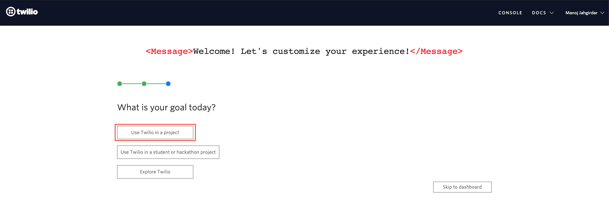

- The final question asked to you would be **What do you want to do first?**, select **Send WhatsApp messages** to proceed.

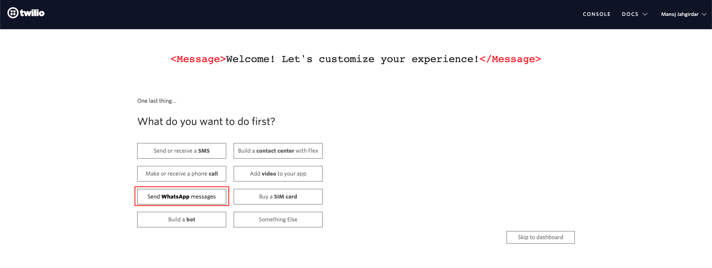

- You will then see a popup box requesting you to **Activate Your Sandbox**, click on **I agree** checkbox and click **Confirm**.

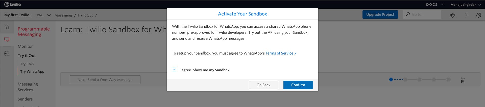

- The sandbox for WhatsApp will appear, make a note of the `Sandbox Name` which will be prefixed with **join**, click on **Settings** on the left panel and select **WhatsApp Sandbox Settings**.

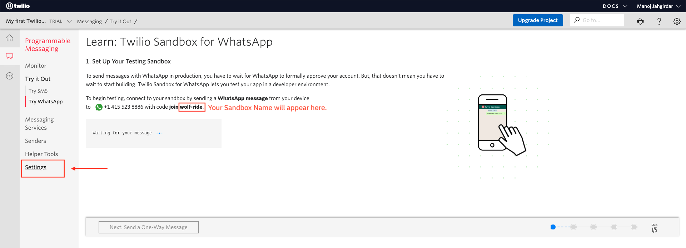

- In **WhatsApp Sandbox Settings** page, under **Sandbox Configuration**, there will be a field called **WHEN A MESSAGE COMES IN**, replace the existing URL in that field with the `URL` obtained by deploying the framework from [Step 2](#2-deploy-the-framework-on-ibm-cloud-foundry), finally click on **Save** to save the configuration.

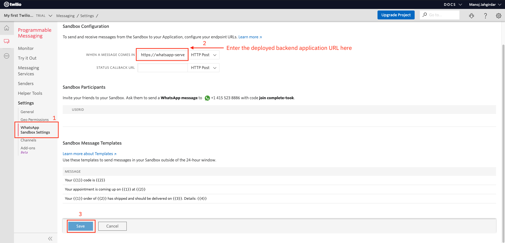

>NOTE: Sometimes the changes are not saved in Twilio WhatsApp Sandbox Settings even after clicking on save, reload the page to enusre the `URL` that you have entered in **WHEN A MESSAGE COMES IN** field is reflecting over there. If you still see the old URL over there then enter the `URL` from [Step 2](#2-deploy-the-framework-on-ibm-cloud-foundry) again and save it.

- Now the Backend server is configured in Twilio, any message that you send from WhatsApp from this point will go to the backend server via Twilio WhatsApp Sandbox. However to reply back to you from WhatsApp the backend server needs to establish connection with Twilio.

- To establish connection between the backend server and Twilio we need to get the `account_sid` and `auth_token` from Twilio.

- Visit <https://www.twilio.com/console> and expand the **Project Info** tab. You will see the `ACCOUNT ID` and `AUTH TOKEN`, copy it in some notepad as it will be used in [Step 5](#5-configure-credentials).

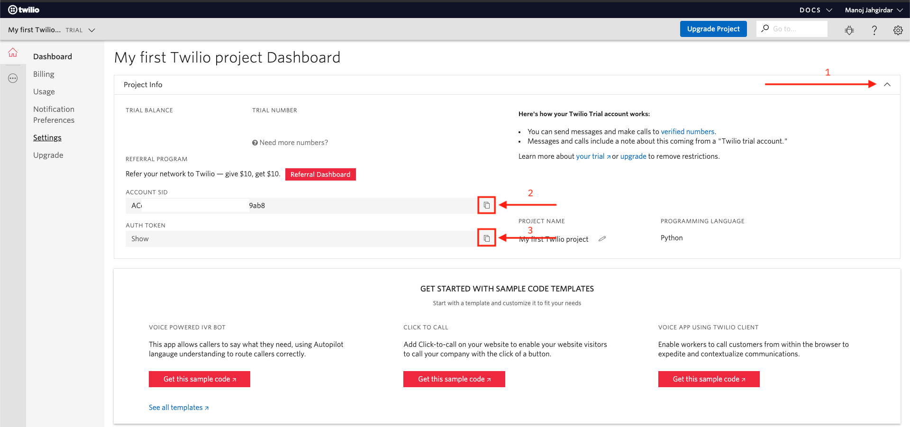

- At this point, you should have the `Sandbox Name`, `account_sid` and `auth_token` from Twilio service.

- Now lets create the required watson services.

### 4. Create Watson services

Create the following services:

#### 4.1. Watson Machine Learning

- Login to IBM Cloud, and create a [**Watson Machine Learning**](https://cloud.ibm.com/catalog/services/machine-learning) service, select **region** as `London` and click on **create** as shown.

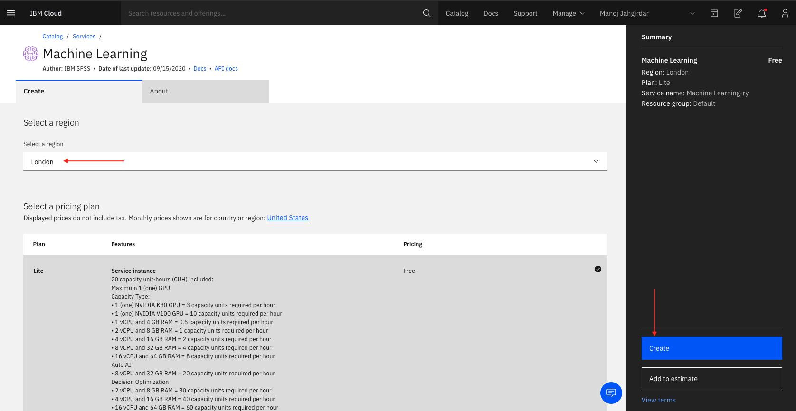

- Once the service is created, click on the **Manage** tab and select **Access (IAM)**, the cloud Identity and Access Management page will be displayed.

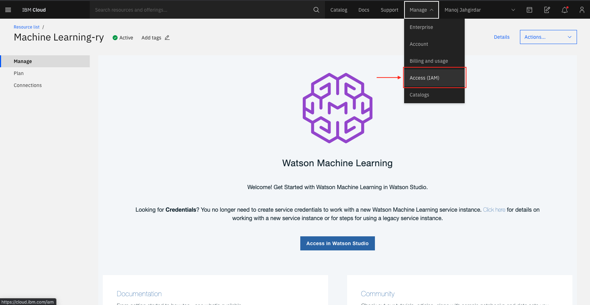

- Click on **API keys** on the left panel as shown.

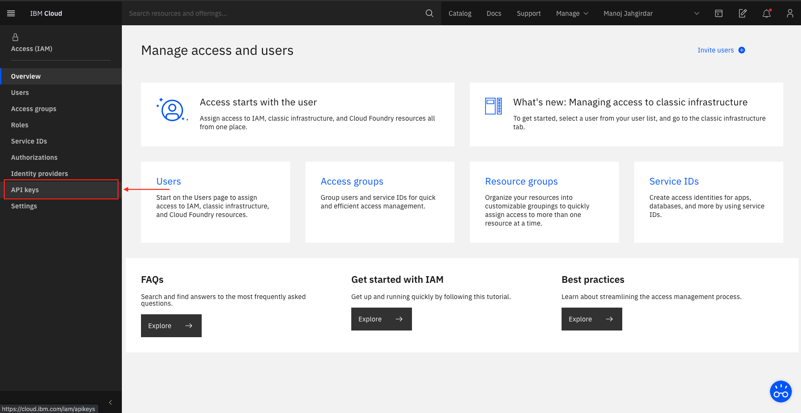

- In **API keys**, click on **Create an IBM Cloud API key** and give a Name and Description Accordingly as shown.

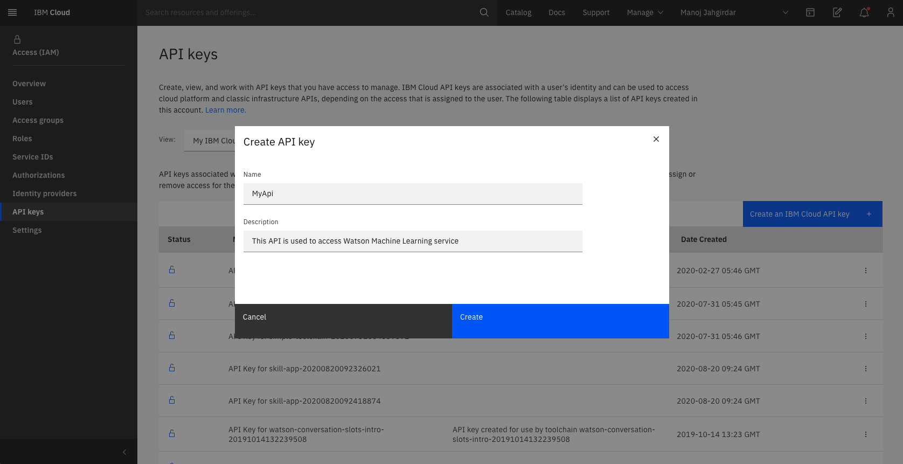

- Once the API key is generated Successfully, copy the key in any text editor as it will be used in [Step 5](#5-configure-credentials).

>NOTE: The API key will not be visible once the dialog box is dismissed, you can **Download** the API key to keep it handy just in case you loose the copied key.

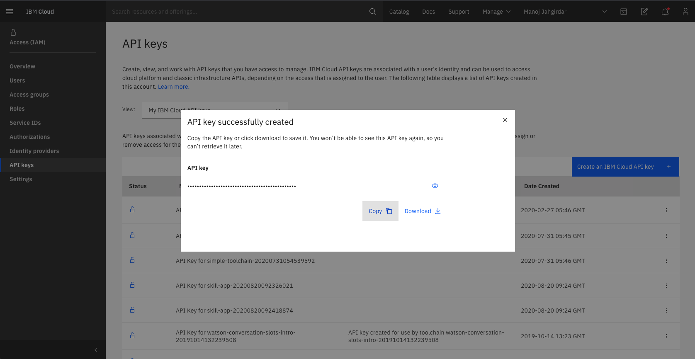

#### 4.2. Watson Studio

- Back to IBM Cloud, create a [**Watson Studio**](https://cloud.ibm.com/catalog/services/watson-studio) service, select **region** as `London` and finally click on **create** as shown.

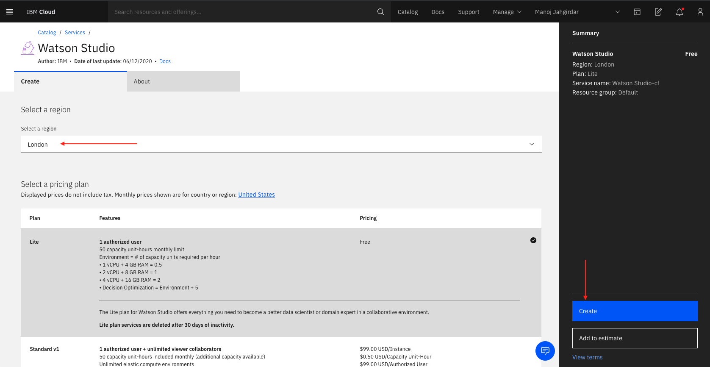

- Once the service is created, click on **Get Started** to provision an IBM Cloud Pak for Data instance.

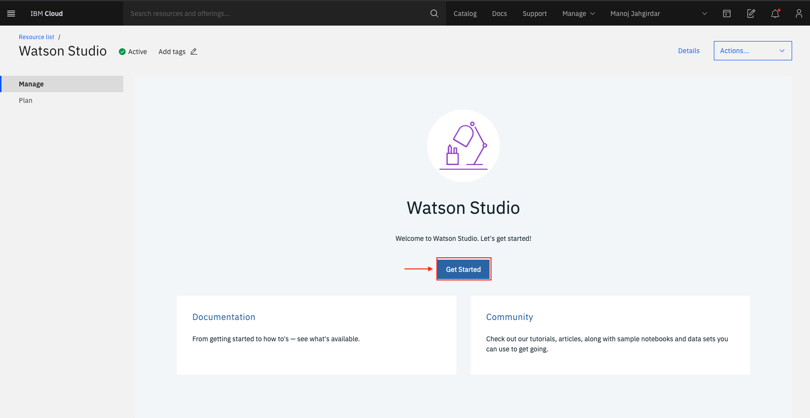

- In Watson Studio / IBM Cloud Pak for Data, click on the hamburger menu on the top left corner and select **Deployment spaces > View all spaces**.

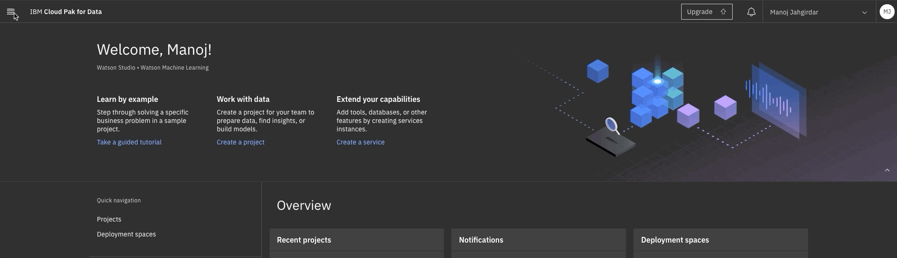

- In deployment spaces, click on **New deployment space +**.

- Select **Create an empty space** when prompted.

- Make sure you select the appropriate **Cloud object storage service** as well as **Machine learning service**.

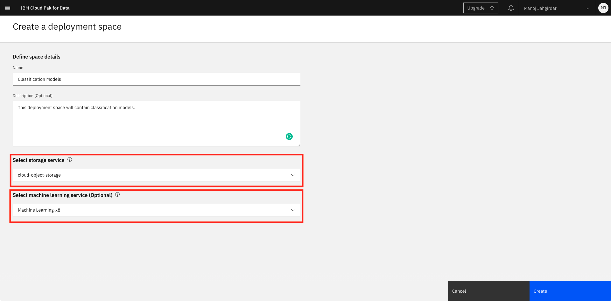

>NOTE: In v4 Machine learning assets are stored in Cloud Object Storage rather than in the Watson Machine Learning repository.

- Once the deployment space is created, click on **View Space** to view the details.

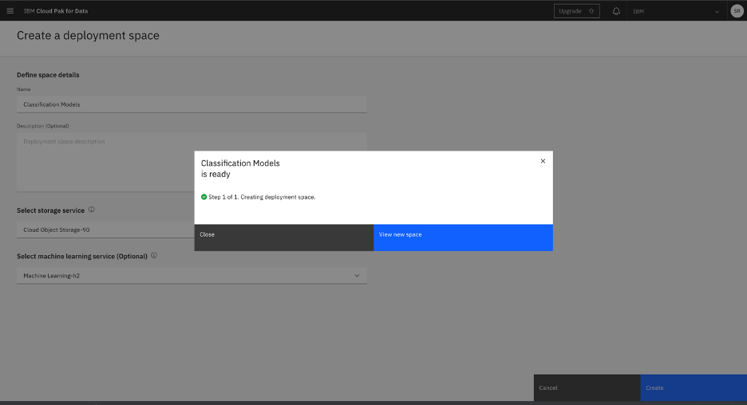

- Click on **Settings** and copy the `space ID` as it is required in [Step 5](#5-configure-credentials).


> Learn more about deployment space [here](https://eu-gb.dataplatform.cloud.ibm.com/docs/content/wsj/wmls/wmls-deploy-overview.html).

- At this point, you should have the `API key` and the `Space ID` copied in any notepad as these will be used in the next  step.

### 5. Configure credentials

- In [Step 3](#3-create-twilio-service), you will have created the twilio service and obtained the credentials and in [Step 4](#4-create-watson-services), you will have also created the Watson machine learning service and obtained the credentials, now you can add the credentials to the framework by following the simple steps stated below.

- Back to the framework, under **Add Twilio service to the Application**, click on the **Add Twilio Credentials** button and insert the twilio `account_sid` and `auth_token` which were generated from [Step 3](#3-create-twilio-service) and finally click on **Submit**. You will now see the status as `Configured`.


- Similarly, under **Add Watson services to the Application**, select the **Watson Machine Learning** radio button and click on **Add Watson Credentials** button, here add the `apikey`, `region` and `space_id` which were generated from [Step 4](#4-create-watson-services) and finally click on **Submit**. You will now see `Watson Machine Learning` under **Configured Services**.


- At this point, you have successfully configured the framework that connects Watson services to WhatsApp.

### 6. Deploy the Food Price Prediction model

- Now that the framework is configured, you can deploy the sample model from the framework.

- The sample model is a Food Price Prediction model built to predict food prices in most countries of the world.

- In the framework, click on the **Deploy Model** tab, and you will see the details of the model.

>NOTE: The dataset for the sample house price prediction model is taken from FAO, credits to [FAO Food price data](http://www.fao.org/faostat/en/#data/QD) from Food and Agriculture Organization of the United Nations and it is under the License of **CC0: Public Domain**.

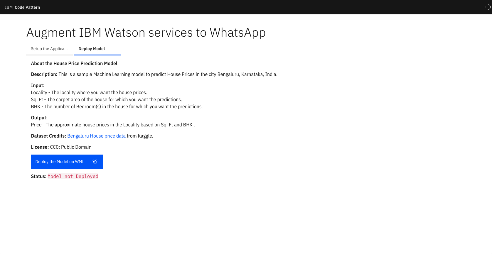

- Click on **Deploy the Model on WML** button and wait for the **Status** to change.

>Note: It will take couple of minutes for the model to get deployed, please be patient.

- Once the model is deployed you will see a **Status** as `Deployed, Model ID: xxx-xxx-xxx`.

- At this point, all the setup is completed and now its time to explore what you just built!

# Sample output

- In the framework, you will see **View Application in Action** tab.

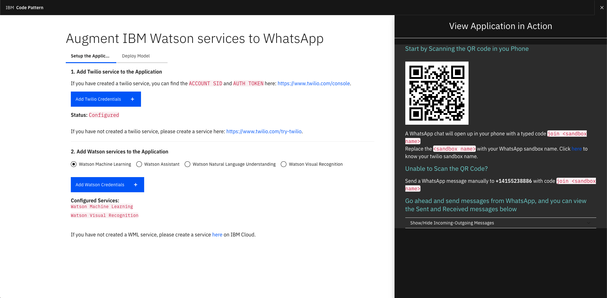

- Scan the QR code in your Phone to open the WhatsApp chat with Twilio's messaging API.

- A WhatsApp chat will open up in your phone with a typed code `join <sandbox name>`.

- Replace the `<sandbox name>` with your `Sandbox Name` obtained from [Step 3](#3-create-twilio-service) and send the message.

>NOTE: If you are unable to scan the QR code, save the phone number **+14155238886**, open WhatsApp and send a message to the saved number with code `join <sandbox name>`.

The workflow of the app is as follows:

>NOTE: The user has to follow the exact same workflow for the WhatsApp to reply as intended.

## Flow Architecture:

User|Reply|Screenshot
---|---|---
Hi | The message, 'Hi' that you typed on your phone, went through Whatsapp -> Twilio -> Python App hosted on IBM Cloud and returned back to you from Python App hosted on IBM Cloud -> Twilio -> Whatsapp. How Cool is that!! Try asking <b>What can you do?</b> | 
What can you do? | I am a bot who is connected to watson services on IBM Cloud! Try asking <b>What are the services you are connected to?</b> | 
What are the services you are connected to? | I found the following services associated to me: 1. Watson Machine Learning -> *ready* Enter the number to know more. 2. Watson Visual Recognition -> No Custom Model Deployed 3. Watson Assistant -> For Agriculture News| 
1 | WML Model id: *xxxx-xxxx-xxxx* WML Model Name: *Deployment of Food Price Prediction* WML Model Status: *ready* Try asking <b>I want to know food prices</b> | 
I want to know food prices | Please enter the details with the below format: Predict:`<Country>`,`<Item>`, Example: Predict:Germany,Apples | 
3 | Watson Assistant Type <b>News</b> for Agriculture News | 


At the end of the code pattern you will have learnt how to build a framework that connects WhatsApp to any Watson service on IBM Cloud, you can add other Watson services to the framework just by creating the desired service, adding the credentials in the framework and writing a code block leveraging the service in a serverless cloud function action.

## Resources/References
1. [Augment IBM Watson Services to WhatsApp](https://github.com/IBM/augment-watson-services-to-whatsapp)

2. [Augment Watson Visual Recognition service with WhatsApp](https://github.com/IBM/augment-watson-services-to-whatsapp-2)